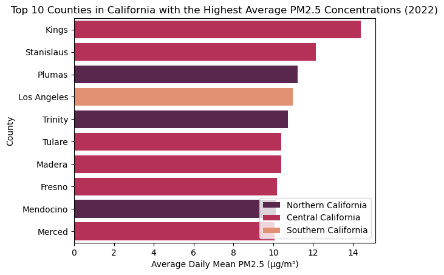
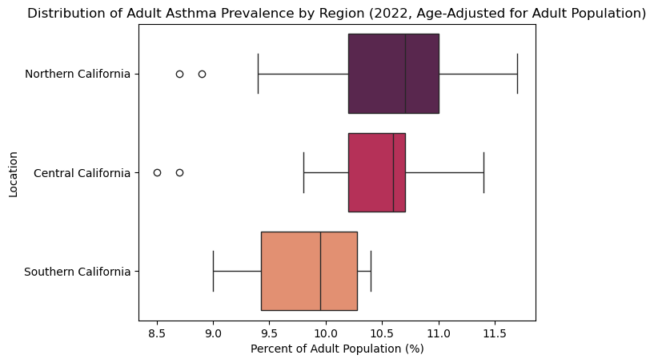
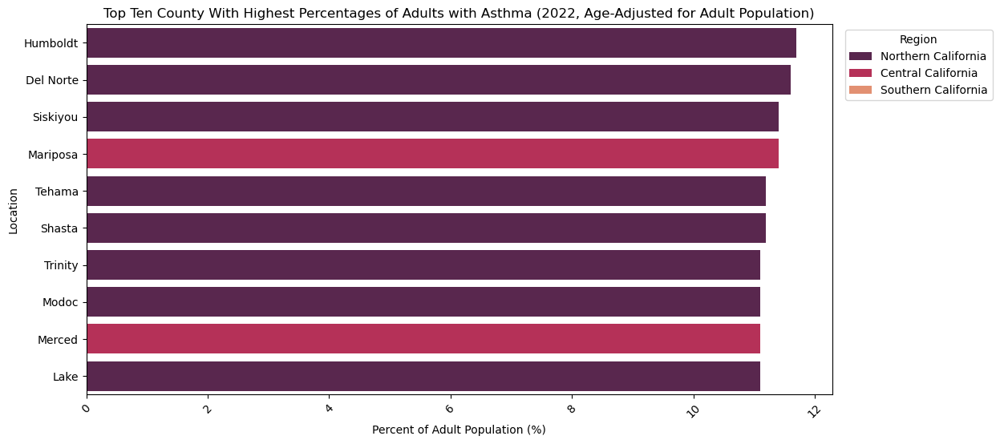

# The Influence of PM2.5 Air Pollution on Asthma Rates in California Adults

Great — thanks for the detailed content. Based on your goal of selectively including key code sections in your project page (not overwhelming it with everything), here's your **revised first section** with **important, well-explained code blocks integrated**.

---

## 🧪 Abstract

Air pollutants such as particulate matter 2.5 (PM2.5) are a significant public health concern, worsened by the effects of climate change. Our study investigates the correlation between PM2.5 pollution levels and adult asthma prevalence in California, aiming to identify regional patterns and explore confounding factors. We integrated county-level asthma prevalence data from the CDC PLACES dataset with EPA’s PM2.5 air quality data.

After preprocessing and aggregating the datasets at the county level, we explored spatial and temporal patterns. Our results revealed that Central California counties consistently exhibit the highest PM2.5 concentrations—surpassing health advisory thresholds—while asthma rates showed mixed alignment, with high prevalence in both Central and Northern California. This suggests the influence of additional regional factors like urbanization and healthcare access.

While our exploratory analysis found regional overlaps between PM2.5 and asthma, the relationship is not conclusively causal. Further studies incorporating socioeconomic, medical access, and environmental confounders are warranted.

---

## 🎯 Research Question

**How do the prevalence and proximity to PM2.5 pollution correlate with the incidences of asthma in adults in California?**

---

## 📚 Background and Prior Work

The American Lung Association conducts annual “State of the Air” reports and recently revealed that 40% of Americans live in regions with unhealthy air pollution levels. This indicates a decline in progress toward clean air, which is assumed to have been exacerbated by the effects of climate change. Since 2020, the number of affected individuals has surged by nearly 12 million, rising from 131 million. This alarming trend underscores the need to examine how industrial pollutants impact public health, particularly regarding respiratory diseases such as asthma. As air quality continues to deteriorate in many urban centers, it is essential to investigate the correlation between pollution exposure and the incidence of these health issues, especially among the most vulnerable populations in densely populated areas of the United States.

In 1993, scientists were interested in the association between air pollution and daily mortality rates and decided to conduct a population-based, cross-sectional survey investigating cities in the United States. They controlled for individual risk factors in their data collection and conducted a survival analysis with Cox proportional-hazard regression modeling. They studied 8,111 adults in 6 U.S. cities and followed up on them fourteen to sixteen years later. Unsurprisingly, the results demonstrated that mortality was strongly associated with cigarette smoking. On average, the mortality rate of the most polluted cities in the U.S. was 1.26 times greater than the mortality rate of the least polluted cities. There was a strong positive correlation between air pollution with lung cancer and pulmonary disease.1 This relates to our project because we are interested in seeing if there is a relationship between the prevalence of respiratory disease with air pollutants.

Another study conducted was in Italy starting in 2000. The most populated cities of Italy were included in this study, with the exception of Naples. The researchers ran their analyses on the risks of hospital admissions and mortality rates by cities using Bayesian modeling. The researchers involved found positive associations between death and hospital admissions for both cardiovascular and respiratory diseases. They also found trends in mortality when ozone was present in the warm seasons. The scientists found the effect of pollutants and risks of mortality were statistically more significant during the warm season and could have many challenges associated with it. For example, hospitals may have less bedding available during the warm season. 2 This relates to our project because we are interested in how external factors may influence the prevalence of respiratory diseases.

**Citations**

^ Dockery, D. W., Pope, C. A., 3rd, Xu, X., Spengler, J. D., Ware, J. H., Fay, M. E., Ferris, B. G., Jr, & Speizer, F. E. (1993). An association between air pollution and mortality in six U.S. cities. The New England journal of medicine, 329(24), 1753–1759. https://doi.org/10.1056/NEJM199312093292401
^ Biggeri, A., Bellini, P., Terracini, B., & Italian MISA Group (2001). Metanalisi italiana degli studi sugli effetti a breve termine dell'inquinamento atmosferico [Meta-analysis of the Italian studies on short-term effects of air pollution]. Epidemiologia e prevenzione, 25(2 Suppl), 1–71. https://pubmed.ncbi.nlm.nih.gov/11515188/
^ Borunda, A. (2024, April 24). 130 million Americans breathe unhealthy air, State of the Air report finds. NPR. https://www.npr.org/2024/04/24/1246729103/unhealthy-dangerous-air-hurts-130-million-americans

---

## 🧪 Hypothesis

> There will be a strong positive correlation between the prevalence and proximity to PM2.5 pollution and the incidence of asthma in adults, in the state of California.

---

## 📊 Data Sources

- **CDC PLACES County-Level Health Data**
  [Link](https://data.cdc.gov/500-Cities-Places/PLACES-Local-Data-for-Better-Health-County-Data-20/swc5-untb/about_data)

- **EPA Air Quality System (AQS) PM2.5 Data**
  [Link](https://www.epa.gov/outdoor-air-quality-data/download-daily-data)

---

## 🧼 Data Collection & Preprocessing

### CDC PLACES: County-Level Asthma Prevalence

We pulled the full dataset via API and filtered for:

- California counties only
- Rows with `measureid == 'CASTHMA'` (Adult asthma)
- Crude prevalence percentages

```python
import pandas as pd
import requests, io

# Load in CDC PLACES data in safe chunks
def places_api(places_url):
    all_data = []
    chunk_size = 50000
    offset = 0

    while True:
        params = {"$limit": chunk_size, "$offset": offset}
        response = requests.get(places_url, params=params)

        if response.status_code != 200:
            break

        data_chunk = pd.read_csv(io.StringIO(response.text))
        if data_chunk.empty:
            break

        all_data.append(data_chunk)
        offset += chunk_size

    return pd.concat(all_data, ignore_index=True)

# Load and filter California data
places = places_api("https://data.cdc.gov/resource/swc5-untb.csv")
places_ca = places[places["stateabbr"] == "CA"]
places_ca_asthma = places_ca[
    (places_ca["measureid"] == "CASTHMA") &
    (places_ca["data_value_type"] == "Crude prevalence")
]
```

✅ **Validation Check:**

```python
# Confirm all 58 counties are included
places_counties = set(places_ca_asthma["locationname"].unique())
expected_ca_counties = {...}  # full set of 58 counties
assert places_counties == expected_ca_counties
```

---

### EPA AQS: PM2.5 Pollution Data

We used EPA's AirData download tool to retrieve daily mean PM2.5 values for California in 2022. After cleaning, we aggregated by county to get annual averages:

```python
epa = pd.read_csv("epa_california_2022.csv")

# Keep relevant columns
epa = epa[["Date", "County", "Arithmetic Mean", "AQI"]]
epa = epa.rename(columns={
    "Arithmetic Mean": "PM2.5_Concentration",
    "AQI": "AQI_Value"
})

# Ensure county names match PLACES dataset format
epa["County"] = epa["County"].str.replace(" County", "")

# Aggregate average PM2.5 values by county
epa_grouped = epa.groupby("County")[["PM2.5_Concentration", "AQI_Value"]].mean().reset_index()
```

---

### 🔗 Merging the Datasets

We merged the datasets by matching county names:

```python
# Align column names
places_ca_asthma = places_ca_asthma.rename(columns={"locationname": "County"})

# Merge by county
merged_df = pd.merge(places_ca_asthma, epa_grouped, on="County", how="inner")
```

This left us with a clean dataset, one row per county, containing:

- Adult asthma prevalence (`data_value`)
- Average PM2.5 concentration
- Average AQI value

---

Here’s a polished **"Cleaning the Data"** section for your GitHub project README:

---

## 🧹 Cleaning the Data

To prepare for analysis, we cleaned and filtered both the **asthma prevalence** and **PM2.5 air pollution** datasets to focus specifically on **California in 2022**. Below is an overview of our filtering and transformation process.

---

### 🫁 Asthma Data (PLACES Dataset)

We begin by narrowing our scope to only California counties and filtering for the **"Current asthma among adults"** measure:

```python
ca_places = places[
    (places['stateabbr'] == 'CA') &
    (places['measureid'] == 'CASTHMA')
]
```

This yields 116 rows—**two entries per county** representing:

- `Crude prevalence`
- `Age-adjusted prevalence`

#### 📦 Initial Cleaning

We removed repeated or irrelevant columns:

```python
ca_places = ca_places.drop(columns=[
    "year", "stateabbr", "statedesc", "datasource",
    "geolocation", "locationid", "category", "categoryid",
    "measure", "measureid", "short_question_text",
    "data_value_unit", "data_value_footnote_symbol", "data_value_footnote"
])
```

📌 **Why drop these?**

- The dataset is fixed to 2022 California.
- Identifiers and geolocation data were redundant with the `'locationname'` column.
- Units and footnotes were constant or missing.

#### 🔁 Pivoting the Table

We pivoted the table to consolidate the two prevalence types into a single row per county:

```python
prevalence_pivot = ca_places.pivot(
    index='locationname',
    columns='data_value_type',
    values=['data_value', 'low_confidence_limit', 'high_confidence_limit']
)
```

Columns were then renamed for clarity:

```python
prevalence_pivot.columns = [
    f"{'age' if 'Age' in val_type else 'crude'}_{metric}"
    for metric, val_type in prevalence_pivot.columns
]
```

#### ➕ Merging Population Data

We joined in the population columns for each county:

```python
ca_places = ca_places[['locationname', 'totalpopulation', 'totalpop18plus']].drop_duplicates()
ca_places = pd.merge(prevalence_pivot.reset_index(), ca_places, on='locationname')
```

✅ **Result:** A clean DataFrame with 58 counties and the following columns:

| Column                                               | Description                            |
| ---------------------------------------------------- | -------------------------------------- |
| `locationname`                                       | County name                            |
| `age_data_value`                                     | % of adults with asthma (age-adjusted) |
| `crude_data_value`                                   | % of adults with asthma (crude)        |
| `*_low_confidence_limit` / `*_high_confidence_limit` | Lower/upper bounds                     |
| `totalpopulation` / `totalpop18plus`                 | Population sizes                       |

---

### 🌫️ PM2.5 Pollution Data (EPA Dataset)

We filtered EPA's 2022 daily air quality data for California counties:

```python
pollutant_data = pd.read_csv('ad_viz_plotval_data.csv')
```

#### 📦 Initial Cleaning

We removed columns unrelated to our research question:

```python
pollutant_copy = pollutant_data.drop(columns=[
    'AQS Parameter Code', 'AQS Parameter Description', 'Method Code', 'Method Description',
    'CBSA Code', 'CBSA Name', 'Units', 'Percent Complete', 'County FIPS Code',
    'Source', 'State'
])
```

📌 **Why drop these?**

- Monitoring metadata (e.g., method descriptions) was not required for our analysis.
- All data was already scoped to California and PM2.5.

#### 🧼 Handling Missing Values

We replaced `NaN` entries in `'Local Site Name'` with `"UNKNOWN"`:

```python
pollutant_copy['Local Site Name'] = pollutant_copy['Local Site Name'].fillna('UNKNOWN')
```

#### 🧾 Final Dataset Summary

Our cleaned air quality dataset contains:

| Column                             | Description                                |
| ---------------------------------- | ------------------------------------------ |
| `Date`                             | Date of observation                        |
| `Site ID` / `POC`                  | Monitoring site and instrument identifiers |
| `Daily Mean PM2.5 Concentration`   | µg/m³ value for that day                   |
| `Daily AQI Value`                  | EPA’s Air Quality Index                    |
| `Local Site Name`                  | Monitoring site label                      |
| `County`                           | California county name                     |
| `Site Latitude` / `Site Longitude` | Geolocation of monitoring site             |

✅ **No missing values** remain, and we’re ready to begin analysis and data integration.

---

Here is the **"Results: Exploratory Data Analysis"** section written for your project’s README. It aligns with your formatting, includes all interpretations, and incorporates the interactive and static visualizations:

---

## Results

### Exploratory Data Analysis

#### Top 10 Counties in California with the Highest Average PM2.5 Concentrations (2022)

To identify which counties experience the worst air quality, we computed the average daily mean PM2.5 concentration across all 2022 measurements for each California county. We then visualized the top 10 counties with the highest concentrations.



**Key Insights:**

- The counties with the highest average PM2.5 concentrations were **Kings, Stanislaus, Plumas, Los Angeles, Trinity, Tulare, Madera, Fresno, Mendocino, and Merced**.
- Categorizing these by region:

  - **6/10** were in _Central California_
  - **3/10** were in _Northern California_
  - **1/10** was in _Southern California_

- This suggests **Central California experiences the poorest air quality**, possibly due to its inland geography that limits coastal air flow.
- All 10 counties had average PM2.5 concentrations **above 9 µg/m³**, the National Park Service's cutoff for 'Good' air quality.
- For example, **Kings County** had an average of **14.4 µg/m³**, which is **60% higher** than the recommended 'Good' level:

```python
14.4 / 9 ≈ 1.60
```

#### Proportion of Counties with 'Good' PM2.5 Levels

Approximately **two-thirds (66%)** of California counties had average PM2.5 levels below or equal to 9 µg/m³, qualifying as ‘Good’ air quality. The remaining one-third fell into the ‘Moderate’ category.

---

### Monthly Comparison of Mean and Median PM2.5 Concentrations

To explore seasonal variation, we examined how PM2.5 concentrations fluctuated month-to-month in each county. We computed both the **mean** and **median** for each county and month in 2022.

#### Interactive Visualization

Use the dropdowns below to select a county and compare monthly PM2.5 concentrations:

<iframe
  src="assets/monthly_stats.html"
  width="800"
  height="600"
  frameborder="0"
></iframe>

**Distribution Patterns:**

- Both mean and median PM2.5 values tend to dip in **spring and early summer**, forming a **bimodal pattern** with higher concentrations in **winter and late summer/early fall**.
- **August and September** often show spikes, which may reflect wildfire activity.

**Notable Outliers (Mean ≫ Median):**

- **El Dorado (Sept):** Mean = 15.4, Median = 3.5
- **Mariposa (Jul–Sept):** Mean = 20.2–32.6, Median = 12.1–9.0
- **Nevada (Sept):** Mean = 30.4, Median = 4.1
- **Placer (Sept):** Mean = 24.4, Median = 6.0
- **Siskiyou (Jul):** Mean = 20.0, Median = 3.6

These large gaps suggest that **a small number of extreme PM2.5 days heavily skew the mean**, likely corresponding to **short-term pollution events such as wildfires**.

---

Great! Now that you're wrapping up your **Exploratory Data Analysis** section, here’s a clean, markdown-compatible version of this last section that fits your README:

---

## 📍 Interactive Map of PM2.5 Concentration in California (2022)

We created a choropleth animation using Plotly to display the **monthly average PM2.5 levels** across California counties.

**Key Observations:**

- PM2.5 concentrations are **highest in Central California** during winter.
- There is a shift in **elevated PM2.5 levels to Southern California** in spring.

<iframe
  src="assets/timeline_chloropleth.html"
  width="800"
  height="600"
  frameborder="0"
></iframe>
---

## 🫁 Asthma Prevalence in California (2022)

To compare air quality with respiratory health, we visualized asthma prevalence from CDC’s PLACES dataset.

<iframe
  src="assets/asthma_chloropleth.html"
  width="800"
  height="600"
  frameborder="0"
></iframe>
---

## 🔍 Side-by-Side Comparison: PM2.5 and Asthma Prevalence

To assess the potential correlation between PM2.5 exposure and asthma:

<iframe
  src="assets/comparison_chloropleth.html"
  width="800"
  height="600"
  frameborder="0"
></iframe>
**Insights:**

- Central California shows overlap between high PM2.5 and high asthma rates.
- Northern California has **high asthma prevalence despite moderate PM2.5**, suggesting other contributing factors (e.g., rural health access, housing quality).
- Southern California, despite seasonal PM2.5 spikes, shows **lower asthma prevalence**.

---

## 🌫️ AQI Levels by County (2022)

We applied a similar analysis to **Air Quality Index (AQI)** to explore general pollution exposure.

<iframe
  src="assets/aqi_levels.html"
  width="800"
  height="600"
  frameborder="0"
></iframe>
---

## 🔬 Regional Asthma Analysis

To contextualize our findings further, we examined asthma rates **by region**.

### Regional Distribution of Asthma (Age-Adjusted)



### Top 10 Counties for Asthma Prevalence



**Summary:**

- **Northern California** leads in asthma prevalence.
- **Southern California** has neither high asthma nor high PM2.5 presence in the top 10 counties.
- These patterns support the hypothesis that **PM2.5 concentrations correlate with asthma rates**, but also emphasize the **role of confounders** (e.g., population density, healthcare access, socioeconomic status).

---
